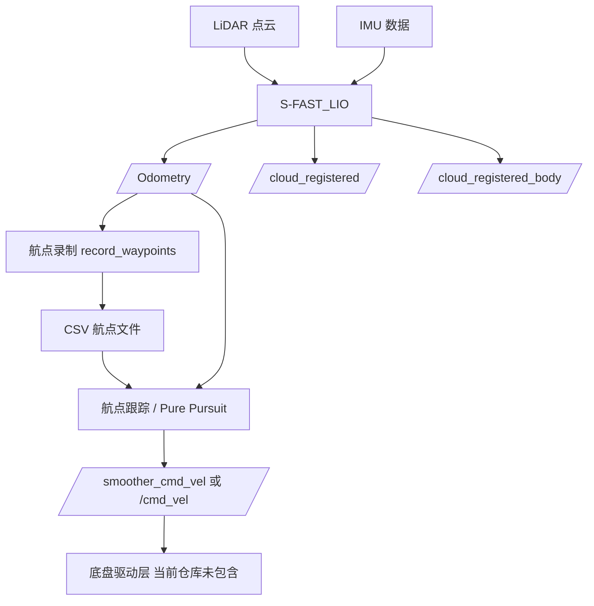
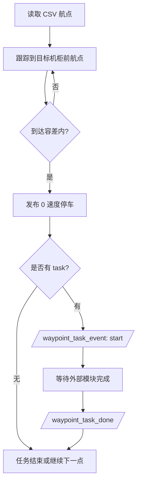
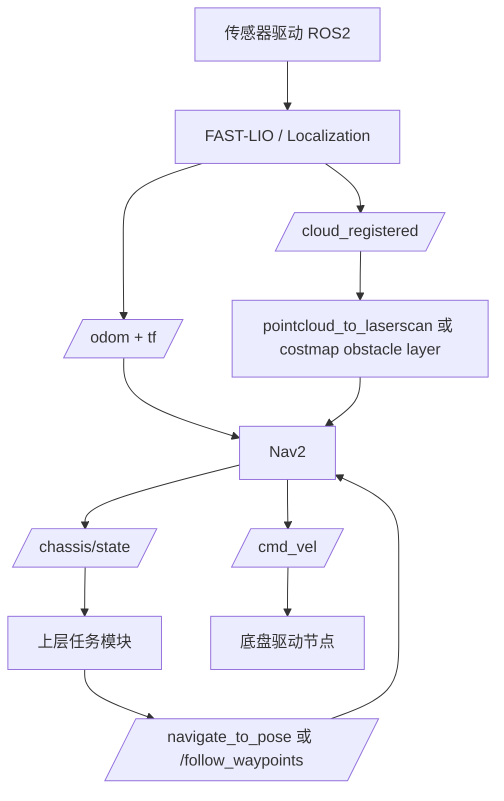
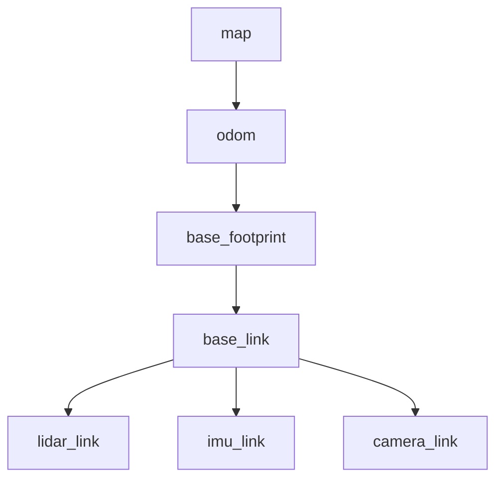
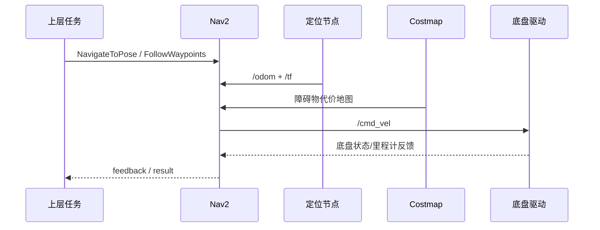
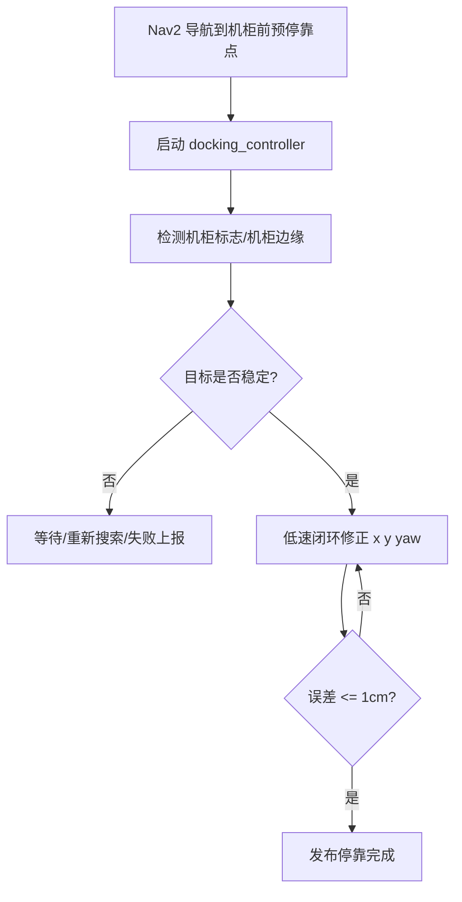
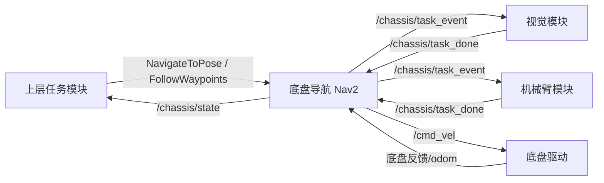

# 机房巡检底盘模块技术文档（简版）

文档版本：v0.2  
当前代码环境：Ubuntu 20.04 + ROS Noetic  
目标运行环境：Ubuntu 22.04 + ROS2 Humble  

## 0. 说明

当前仓库是 ROS1 工程，主要包含底盘上层导航能力：建图/定位、航点录制、轨迹跟踪、局部避障、任务点事件。  
目标项目要求 ROS2 Humble，因此当前代码不能直接复制运行，需要迁移或替换为 ROS2/Nav2 架构。

本文只保留三部分：

1. ROS1 当前已有能力。
2. ROS2 需要完成的任务。
3. ROS2 对外接口设计。

注意：当前仓库没有正式测试报告，因此不能宣称已经满足：

- 定位 ±2 cm。
- 避障 ≥99%。
- 定点停靠 ±1 cm。

这些应作为 ROS2 版本的验收目标。

---

# 一、ROS1 当前已有能力

## 1. 总体完成情况

| 模块 | 当前状态 | 代码位置 | 说明 |
| --- | --- | --- | --- |
| SLAM 建图 | 已有 ROS1 实现 | `src/S-FAST_LIO` | 基于 FAST-LIO 思路，融合 LiDAR + IMU，输出里程计和点云地图 |
| 重定位 | 已有 ROS1 原型 | `laserMapping_re.cpp` | 可加载 `PCD/GlobalMap_ikdtree.pcd` 做重定位原型 |
| 航点录制 | 已实现 | `record_waypoints.py` | 订阅 `/Odometry`，保存 CSV 航点 |
| 航点跟踪 | 已实现 | `follow_waypoints.py`、`pure_pursuit_follower.py` | 读取 CSV，输出速度指令 |
| Pure Pursuit | 已实现 | `pure_pursuit_follower.py` | 支持差速/履带和阿克曼参数 |
| Pure Pursuit + A* | 原型实现 | `pure_pursuit_astar_follower.py` | 使用点云或 LaserScan 做局部 A* 避障 |
| move_base + TEB/DWA | 原型配置 | `waypoint_tools/launch`、`waypoint_tools/config` | ROS1 导航栈配置，ROS2 中需替换为 Nav2 |
| 任务点机制 | 已实现 | `waypoint_task_event`、`waypoint_task_done` | 支持停车、等待外部任务完成 |
| 底盘驱动 | 当前仓库没有 | - | 没有 CAN/串口/电机驱动代码，只输出 `Twist` |

## 2. ROS1 当前运行流程



## 3. 当前自主导航进度

需求：SLAM 建图、微模块窄通道移动、路径规划、动态避障、定位 ±2 cm、避障 ≥99%。

当前完成度：

| 需求点 | 当前进度 | 说明 |
| --- | --- | --- |
| SLAM 建图 | 已有 ROS1 实现 | S-FAST_LIO 已能发布 `/Odometry`、点云和路径 |
| 重定位 | 已有原型 | 可加载 PCD 地图，但还不是 ROS2 工程化版本 |
| 窄通道移动 | 有基础控制能力 | Pure Pursuit 支持低速跟踪、原地转向、速度限幅 |
| 路径规划 | 有 ROS1 原型 | 包含 move_base + TEB/DWA 配置，以及自研 A* 原型 |
| 动态避障 | 有原型 | 点云转 LaserScan、costmap、A* 障碍栅格、安全停车逻辑 |
| 定位 ±2 cm | 待验证 | 当前没有精度测试报告 |
| 避障 ≥99% | 待验证 | 当前没有统计测试报告 |

## 4. 当前定点停靠进度

需求：精准停靠至目标机柜前指定位置，目标 ±1 cm。

当前完成度：

| 子功能 | 当前进度 | 说明 |
| --- | --- | --- |
| 记录停靠点 | 已实现 | CSV 中记录目标点位置、姿态、任务字段 |
| 到点停车 | 已实现 | 支持 `stop_Xs` 任务点 |
| 终点低速逼近 | 已实现基础逻辑 | `pure_pursuit_follower.py` 中有接近终点减速 |
| 终点 yaw 对齐 | 差速/履带支持 | 阿克曼车不能原地旋转，需要特殊处理 |
| 外部任务联动 | 已实现原型 | 到点后发布任务事件，等待其他模块完成 |
| ±1 cm 精停 | 尚未实现/未验证 | 仅靠当前全局航点跟踪不足以保证 1 cm |

当前定点停靠流程：



结论：

- 当前可以做到“按航点停到机柜前附近”。
- 当前不能保证“±1 cm 精准停靠”。
- ROS2 版本建议增加独立 `docking_controller`，使用视觉标志、机柜边缘、短距传感器等做最后闭环。

---

# 二、ROS2 Humble 需要完成的任务

## 1. ROS2 总体目标架构

建议 ROS2 版本不要继续硬搬 ROS1 `move_base + TEB`，而是采用 Nav2 作为主导航框架。



## 2. ROS2 迁移任务清单

| 优先级 | 任务 | 说明 |
| --- | --- | --- |
| P0 | 建立 ROS2 Humble 工作区 | 使用 `colcon`、`ament_cmake`、`ament_python` |
| P0 | 传感器驱动 ROS2 化 | 使用 ROS2 版 `livox_ros_driver2` 或对应雷达驱动 |
| P0 | 迁移/替换 FAST-LIO | 发布 ROS2 `/odom`、`/tf`、点云 |
| P0 | 统一 TF 坐标树 | 标准化为 `map -> odom -> base_link -> lidar_link` |
| P0 | 接入底盘驱动 | 明确 `/cmd_vel` 到真实底盘的转换 |
| P1 | 接入 Nav2 | 替代 ROS1 `move_base + TEB/DWA` |
| P1 | 迁移航点录制/执行 | `rospy` 改为 `rclpy`，或用 Nav2 waypoint follower |
| P1 | 实现任务点接口 | 替代当前 `/waypoint_task_event` 字符串协议 |
| P1 | 实现状态上报 | 给上层和容器管理提供状态 |
| P2 | 实现精准停靠 | 新增 `docking_controller`，目标 ±1 cm |
| P2 | 建立验收脚本 | 统计定位误差、避障成功率、停靠误差 |
| P2 | 容器化支持 | Dockerfile、启动脚本、参数挂载、日志挂载 |

## 3. ROS2 中建议替换关系

| ROS1 当前实现 | ROS2 Humble 建议 |
| --- | --- |
| `catkin_make` / catkin package | `colcon build` / ament package |
| `roscpp` | `rclcpp` |
| `rospy` | `rclpy` |
| `tf` | `tf2_ros` |
| `roslaunch *.launch` | `ros2 launch *.launch.py` |
| `move_base` | Nav2 `bt_navigator` |
| `move_base_msgs/MoveBaseAction` | `nav2_msgs/action/NavigateToPose` |
| `actionlib` | ROS2 action |
| `teb_local_planner` | Nav2 RPP / DWB / MPPI / Smac Planner |
| `/smoother_cmd_vel` | 建议统一为 `/cmd_vel` |
| CSV 航点直接驱动 | Nav2 waypoint/action 或保留 CSV 但由 ROS2 节点执行 |

## 4. 推荐 ROS2 功能分包

```text
chassis_ws/
  src/
    chassis_bringup/          # 总启动 launch 和参数
    chassis_localization/     # FAST-LIO 或定位适配
    chassis_navigation/       # Nav2 配置
    chassis_waypoint_tools/   # 航点录制、航点转换、巡检路线
    chassis_docking/          # 精准停靠控制
    chassis_interfaces/       # 自定义 msg/srv/action
    chassis_description/      # URDF、TF、底盘模型
```

## 5. ROS2 定位与建图任务

需要完成：

1. 将 LiDAR 和 IMU 驱动切到 ROS2。
2. 确认点云、IMU 时间戳正确。
3. 迁移或替换当前 `S-FAST_LIO`。
4. 发布标准 ROS2 话题：
   - `/odom`
   - `/tf`
   - `/cloud_registered`
   - `/map_cloud`
5. 统一坐标系：
   - `map`
   - `odom`
   - `base_link`
   - `lidar_link`
   - `imu_link`
6. 完成定位精度测试，验证是否达到 ±2 cm。

建议 TF：



## 6. ROS2 自主导航任务

需要完成：

1. 使用 Nav2 替换 ROS1 `move_base`。
2. 配置 global costmap 和 local costmap。
3. 接入点云或 LaserScan 障碍物。
4. 配置 planner：
   - 差速/履带底盘：`SmacPlanner2D` 或 `NavFn`。
   - 阿克曼底盘：`SmacHybrid` 或 `State Lattice`。
5. 配置 controller：
   - 差速/履带底盘：`RegulatedPurePursuit`、`DWB` 或 `MPPI`。
   - 阿克曼底盘：建议优先评估 `MPPI` 或自定义控制器。
6. 建立动态避障测试，统计避障成功率是否 ≥99%。

导航执行流程：



## 7. ROS2 精准停靠任务

当前 ROS1 只具备“到航点停车”的基础能力。  
ROS2 若要达到 ±1 cm，建议新增精准停靠模块。

推荐流程：



需要补充的能力：

| 能力 | 说明 |
| --- | --- |
| 机柜相对定位 | 可用 AprilTag、二维码、机柜边缘、短距激光等 |
| 低速闭环控制 | 最后 0.5 m 到 1.0 m 不建议只靠全局导航 |
| 停靠状态机 | 搜索、对齐、靠近、精修、完成、失败 |
| 停靠误差统计 | 记录纵向误差、横向误差、yaw 误差 |
| 超时和失败处理 | 目标丢失、障碍占用、定位跳变时退出 |

---

# 三、ROS2 对外接口

## 1. 接口设计原则

底盘模块对外尽量只暴露稳定接口：

- 上层任务模块通过 action 下发目标。
- 底盘模块通过状态话题反馈进度。
- 机械臂/视觉通过任务事件与底盘同步。
- 只有底盘控制器或安全节点可以发布 `/cmd_vel`。

## 2. ROS2 标准对外接口

### 2.1 导航目标接口

优先使用 Nav2 标准 action。

| 接口 | 类型 | 方向 | 用途 |
| --- | --- | --- | --- |
| `/navigate_to_pose` | `nav2_msgs/action/NavigateToPose` | 上层 -> 底盘 | 导航到单个机柜或目标点 |
| `/navigate_through_poses` | `nav2_msgs/action/NavigateThroughPoses` | 上层 -> 底盘 | 经过多个目标点 |
| `/follow_waypoints` | `nav2_msgs/action/FollowWaypoints` | 上层 -> 底盘 | 按航点巡检 |

### 2.2 底盘状态接口

| 接口 | 类型 | 方向 | 说明 |
| --- | --- | --- | --- |
| `/chassis/state` | `std_msgs/msg/String` 或自定义 msg | 底盘 -> 上层 | 当前状态 |
| `/chassis/current_goal` | `geometry_msgs/msg/PoseStamped` | 底盘 -> 上层 | 当前目标点 |
| `/chassis/task_event` | `std_msgs/msg/String` 或自定义 msg | 底盘 -> 机械臂/视觉/上层 | 到达任务点、开始外部任务 |
| `/diagnostics` | `diagnostic_msgs/msg/DiagnosticArray` | 底盘 -> 运维/容器管理 | 运行健康状态 |

建议 `/chassis/state` 状态值：

| 状态 | 含义 |
| --- | --- |
| `IDLE` | 空闲 |
| `MAPPING` | 建图中 |
| `LOCALIZING` | 定位中 |
| `NAVIGATING` | 导航中 |
| `AVOIDING` | 避障中 |
| `DOCKING` | 精准停靠中 |
| `WAIT_TASK` | 等待外部任务完成 |
| `PAUSED` | 暂停 |
| `ERROR` | 错误 |
| `EMERGENCY_STOP` | 急停 |

### 2.3 底盘控制接口

| 接口 | 类型 | 方向 | 说明 |
| --- | --- | --- | --- |
| `/cmd_vel` | `geometry_msgs/msg/Twist` | 导航控制器 -> 底盘驱动 | 差速/履带速度指令 |
| `/chassis/emergency_stop` | `std_msgs/msg/Bool` | 安全系统/上层 -> 底盘 | 急停 |
| `/chassis/pause` | `std_msgs/msg/Bool` | 上层 -> 底盘 | 暂停/恢复 |
| `/chassis/manual_cmd_vel` | `geometry_msgs/msg/Twist` | 遥控/调试 -> 底盘 | 手动模式使用，需安全仲裁 |

说明：

- 当前仓库没有实际底盘驱动，因此 ROS2 版本需要明确谁订阅 `/cmd_vel`。
- 如果底盘为阿克曼模型，建议不要长期用 `Twist.angular.z` 表示转角，应考虑 `ackermann_msgs/msg/AckermannDriveStamped` 或写清楚转换规则。

## 3. 建图/定位接口

| 接口 | 类型 | 方向 | 说明 |
| --- | --- | --- | --- |
| `/odom` | `nav_msgs/msg/Odometry` | 定位 -> Nav2/上层 | 机器人里程计 |
| `/tf` | `tf2_msgs/msg/TFMessage` | 定位/robot_state_publisher -> 全系统 | 动态 TF |
| `/tf_static` | `tf2_msgs/msg/TFMessage` | robot_state_publisher -> 全系统 | 静态 TF |
| `/cloud_registered` | `sensor_msgs/msg/PointCloud2` | 定位 -> 可视化/避障 | 注册点云 |
| `/map_cloud` | `sensor_msgs/msg/PointCloud2` | 地图节点 -> 可视化 | 点云地图 |

## 4. 任务点接口

当前 ROS1 使用字符串：

```text
start:<task_name>:idx<index>
done:<task_name>:idx<index>
```

ROS2 初期可以继续保留字符串，便于快速联调：

| 接口 | 类型 | 方向 | 说明 |
| --- | --- | --- | --- |
| `/chassis/task_event` | `std_msgs/msg/String` | 底盘 -> 外部模块 | 通知到达任务点 |
| `/chassis/task_done` | `std_msgs/msg/String` | 外部模块 -> 底盘 | 外部任务完成 |

示例：

```text
/chassis/task_event: start:camera_inspect:idx5
/chassis/task_done: done:camera_inspect
```

长期建议改为自定义消息或 action，避免字符串解析出错。

## 5. 精准停靠接口

建议新增 action：`DockToCabinet`。当前仓库尚未实现，这是 ROS2 版本建议。

输入：

| 字段 | 类型 | 说明 |
| --- | --- | --- |
| `cabinet_id` | `string` | 目标机柜编号 |
| `nominal_pose` | `geometry_msgs/PoseStamped` | 机柜前预估停靠位姿 |
| `target_standoff` | `float32` | 与机柜目标距离 |
| `position_tolerance` | `float32` | 位置容差，目标 0.01 m |
| `yaw_tolerance` | `float32` | 航向容差 |

反馈：

| 字段 | 类型 | 说明 |
| --- | --- | --- |
| `state` | `string` | 当前停靠状态 |
| `longitudinal_error` | `float32` | 纵向误差 |
| `lateral_error` | `float32` | 横向误差 |
| `yaw_error` | `float32` | 航向误差 |

结果：

| 字段 | 类型 | 说明 |
| --- | --- | --- |
| `success` | `bool` | 是否成功 |
| `message` | `string` | 结果说明 |
| `final_pose` | `geometry_msgs/PoseStamped` | 最终停靠位姿 |

## 6. 联调接口关系



## 7. 容器化

| 内容 | 说明 |
| --- | --- |
| ROS2 launch | 一键启动传感器、定位、Nav2、底盘节点 |
| 参数目录 | Nav2 参数、FAST-LIO 参数、底盘尺寸、传感器外参 |
| 地图目录 | PCD/栅格地图/路线文件 |
| 日志目录 | rosbag、运行日志、诊断日志 |
| 设备权限 | LiDAR 网络/USB、CAN、串口、相机 |
| 环境变量 | `ROS_DOMAIN_ID`、`RMW_IMPLEMENTATION`、地图路径、配置路径 |

---

# 四、简要结论

当前 ROS1 仓库已经具备：

- FAST-LIO 系建图/定位代码基础。
- 航点录制和航点跟踪。
- Pure Pursuit 路径跟踪。
- Pure Pursuit + A* 局部避障原型。
- ROS1 move_base + TEB/DWA 配置。
- 到点停车和外部任务事件机制。

ROS2 Humble 版本需要重点完成：

- ROS2 工程迁移。
- 传感器、定位、TF、Nav2 标准化。
- 使用 Nav2 替换 ROS1 move_base。
- 实现稳定的对外 action/topic 接口。
- 新增精准停靠模块。
- 完成定位 ±2 cm、避障 ≥99%、停靠 ±1 cm 的实测验收。

