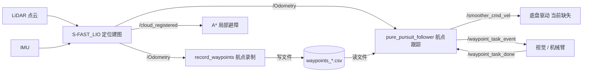
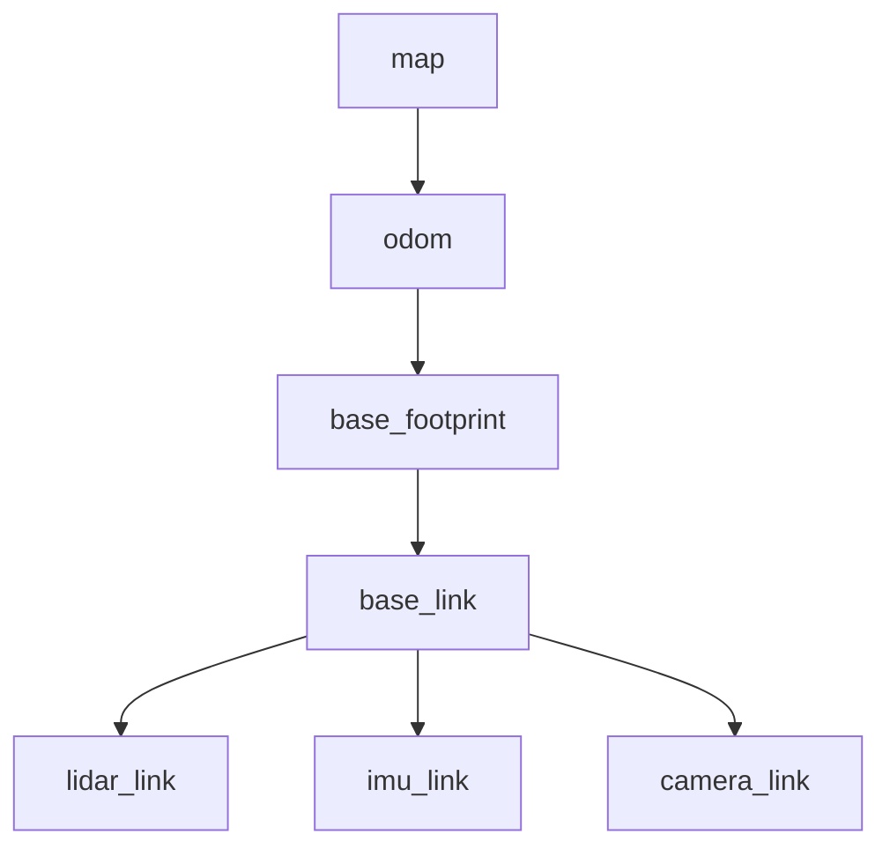
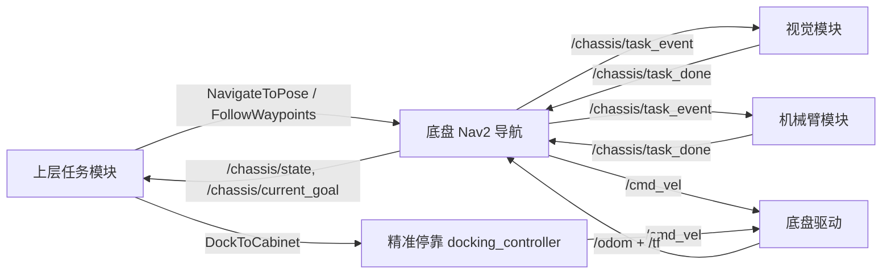
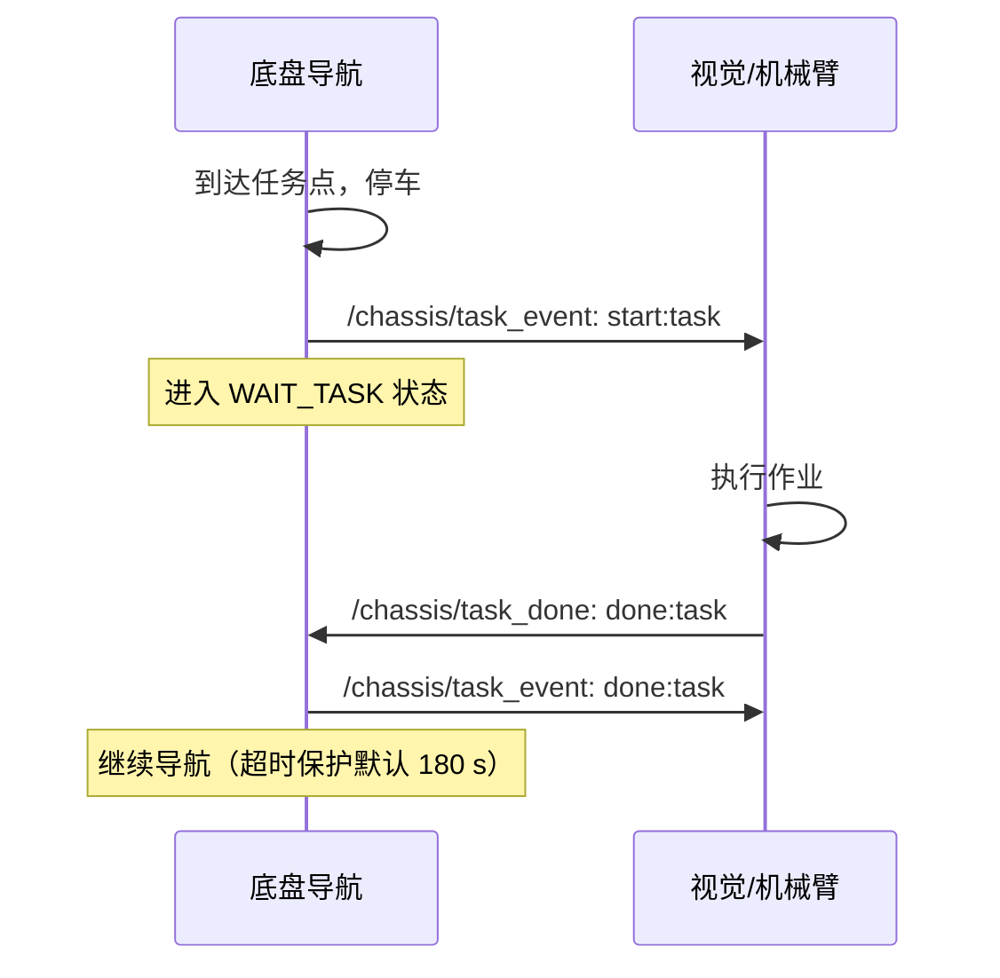
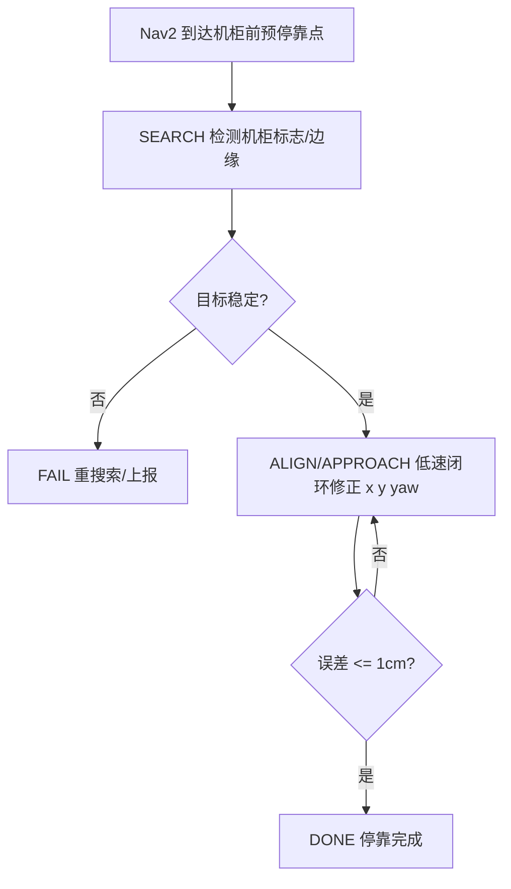

# 底盘迁移与对接（ROS1 → ROS2 Humble）

文档版本：v2.0
当前代码环境：Ubuntu 20.04 + ROS Noetic（ROS1）
目标运行环境：Ubuntu 22.04 + ROS2 Humble

---

## 一、文档说明

本文档聚焦两件事：底盘从 ROS1 到 ROS2 Humble 的**迁移工作**，以及底盘对上层任务、机械臂、视觉、运维等模块的**对外接口定义**。全文以接口为核心，每个接口均明确其类型（话题 / 服务 / 动作）、消息内容、通信方式与坐标系约定，并给出 ROS1 现状与 ROS2 目标的对应关系。

文中 ROS1 现状接口均已核对当前仓库代码（`src/S-FAST_LIO`、`src/waypoint_tools`），非设想。

需要说明的是，当前仓库尚无正式测试报告，"定位 ±2 cm、避障 ≥99%、定点停靠 ±1 cm" 三项指标目前均未经验证，本文将其列为 ROS2 版本的验收目标，而非既有能力。

---

## 二、ROS1 现状接口

### 2.1 系统数据流总览



当前仓库不含任何底盘驱动代码（无 CAN / 串口 / 电机控制），`/smoother_cmd_vel` 尚无实际订阅者驱动电机，此为 ROS2 阶段必须补齐的一环。

### 2.2 定位/建图节点（S-FAST_LIO）对外发布

代码位置：`src/S-FAST_LIO/src/laserMapping.cpp`（重定位版本 `laserMapping_re.cpp`）。

| 话题 | 消息类型 | 方向 | 内容说明 |
| --- | --- | --- | --- |
| `/Odometry` | `nav_msgs/Odometry` | LIO → 下游 | 位姿+速度，`frame_id=camera_init`，`child_frame_id=body` |
| `/cloud_registered` | `sensor_msgs/PointCloud2` | LIO → 避障/可视化 | 配准到世界系的点云 |
| `/cloud_registered_body` | `sensor_msgs/PointCloud2` | LIO → 下游 | 配准到 body 系的点云 |
| `/Laser_map` | `sensor_msgs/PointCloud2` | LIO → 可视化 | 点云地图 |
| `/path` | `nav_msgs/Path` | LIO → 可视化 | 历史轨迹 |
| TF `camera_init → body` | `tf/tfMessage` | LIO → 全系统 | 动态坐标变换 |

关键点：当前坐标系为 `camera_init`（世界系）与 `body`（车体系），非 ROS 标准命名 `map`/`odom`/`base_link`，迁移至 Nav2 时必须标准化；里程计话题为 `/Odometry`（大写 O）。

### 2.3 航点录制节点（record_waypoints.py）

订阅：`/Odometry`（位姿采样）、`/waypoint_task`（String，强制打任务点）、`/waypoint_stop_seconds`（Float32，打定时停靠点）。
输出：写入 CSV 文件 `src/waypoint_tools/data/waypoints_*.csv`，每行字段为：

```
seq, stamp, frame_id, x, y, z, qx, qy, qz, qw, yaw, task, tol
```

`task` 为任务标记（默认 `none`），`tol` 为到点容差（默认 0.30 m）。

### 2.4 航点跟踪节点（pure_pursuit_follower.py）

当前对外行为最关键的节点。

| 方向 | 话题 | 消息类型 | 内容说明 |
| --- | --- | --- | --- |
| 订阅 | `/Odometry` | `nav_msgs/Odometry` | 当前位姿，用于 Pure Pursuit 跟踪 |
| 订阅 | `/waypoint_task_done` | `std_msgs/String` | 外部模块通知任务完成 |
| 发布 | `/smoother_cmd_vel` | `geometry_msgs/Twist` | 速度指令。差速/履带用 `linear.x`+`angular.z`；阿克曼下 `angular.z` 被临时用作前轮转角 |
| 发布 | `/waypoint_task_event` | `std_msgs/String` | 到达任务点时通知外部模块 |

任务事件字符串协议：

- 底盘发出（`/waypoint_task_event`）：`<phase>:<task_name>:idx<index>`，`phase` 取 `start` / `done` / `skip`，例 `start:camera_inspect:idx5`。
- 外部回传（`/waypoint_task_done`）：接受 `done`、`all_done`、`<task_name>`、`done:<task_name>` 任一即判定完成。

CSV 中 `task` 字段支持的任务类型：

| 写法 | 含义 | 行为 |
| --- | --- | --- |
| `none` | 普通路径点 | 正常通过 |
| `stop_10s` / `hold_2m` / `pause_30s` | 定时停车 | 停车等待（s=秒，m=分），到时继续 |
| `detect` | 检测停顿 | 停车固定 `detect_pause_time`（默认 2 s） |
| `ext:<name>` | 外部任务 | 停车、发 `start:<name>`，等 `/waypoint_task_done`，超时 180 s |
| 其它 | 未知任务 | 按策略 `skip`（默认）或 `hold` |

### 2.5 局部避障原型（pure_pursuit_astar_follower.py）

在跟踪基础上增加避障：订阅 `/cloud_registered`（点云）或 `/scan`（激光），发布 `/smoother_cmd_vel`。内部流程为障碍点栅格化 → 膨胀（默认 0.55 m）→ 局部 A* 重规划 → Pure Pursuit 跟踪。ROS2 中该逻辑由 Nav2 的 costmap + planner/controller 替代，不建议照搬。

### 2.6 ROS1 导航栈

`src/waypoint_tools` 内含标准 ROS1 `move_base` 配置（global/local costmap、TEB/DWA 局部规划器），ROS2 中整体替换为 Nav2，配置不可直接复用，但参数思路（膨胀半径、footprint、速度限制）可迁移。

---

## 三、迁移映射：旧接口 → 新接口

### 3.1 框架/工具层

| ROS1 现状 | ROS2 Humble 目标 | 备注 |
| --- | --- | --- |
| `catkin_make` | `colcon build` | 包用 `ament_cmake` / `ament_python` |
| `roscpp` / `rospy` | `rclcpp` / `rclpy` | 节点需重写 |
| `tf` / `TransformBroadcaster` | `tf2_ros` | TF 树命名标准化 |
| `roslaunch *.launch`（XML） | `ros2 launch *.launch.py`（Python） | launch 全部重写 |
| `move_base` + `MoveBaseAction` | Nav2 `bt_navigator` + `NavigateToPose` | 用标准 Nav2 动作 |
| `actionlib` | ROS2 action | |
| `teb_local_planner` / `dwa` | Nav2 `RegulatedPurePursuit` / `DWB` / `MPPI` | 阿克曼优先评估 MPPI |
| ROS1 参数 `~param` | `declare_parameter` + YAML | 新增 QoS 配置 |

### 3.2 话题/消息层（核心）

| 用途 | ROS1 现状 | ROS2 目标 | 变化点 |
| --- | --- | --- | --- |
| 里程计 | `/Odometry`（`camera_init`/`body`） | `/odom`（`odom`/`base_link`） | 话题名与坐标系均标准化 |
| 世界系点云 | `/cloud_registered` | `/cloud_registered` | 保留，QoS 用 SensorData |
| 点云地图 | `/Laser_map` | `/map_cloud` | 建议改名 |
| 速度指令 | `/smoother_cmd_vel` | `/cmd_vel` | 统一为 Nav2 默认名 |
| 障碍来源 | 节点内 A* 处理点云 | Nav2 costmap 障碍层 | 用 `pointcloud_to_laserscan` 或点云层 |
| 到点导航 | 无（CSV+PurePursuit） | `NavigateToPose` 动作 | 标准化 |
| 巡检多点 | CSV 顺序跟踪 | `FollowWaypoints` 动作 | 或保留 CSV 由 rclpy 执行 |
| 任务事件 | `/waypoint_task_event`（String） | `/chassis/task_event` | 协议先保留后升级 |
| 任务完成 | `/waypoint_task_done`（String） | `/chassis/task_done` | 同上 |
| 精准停靠 | 无 | `DockToCabinet` 动作 | 新增 |

### 3.3 坐标系（TF）

| ROS1 现状 | ROS2 标准目标 |
| --- | --- |
| `camera_init`（世界系） | `map`（或 `odom`） |
| `body`（车体系） | `base_link` |
| —— | `base_footprint` |
| （隐含雷达系） | `lidar_link` |
| （隐含 IMU 系） | `imu_link` |

ROS2 目标 TF 树：



实现路径二选一：（A）修改 LIO 源码，直接按 `odom → base_link` 命名发布（推荐，最干净）；（B）LIO 保持原命名，增加转换节点重映射并广播标准 TF（改动小，多一层）。

---

## 四、ROS2 对外接口（核心）

### 4.0 设计原则与接口全景

底盘对外只暴露少量稳定接口：上层通过**动作（Action）**下发导航/巡检/停靠目标；底盘通过**状态话题**反馈进度与健康度；机械臂/视觉通过**任务事件话题**与底盘握手；`/cmd_vel` 仅允许底盘控制器或安全仲裁节点发布。



接口一览：

| 类别 | 接口 | 类型 | 方向 |
| --- | --- | --- | --- |
| 导航 | `/navigate_to_pose` | Action | 上层 → 底盘 |
| 导航 | `/navigate_through_poses` | Action | 上层 → 底盘 |
| 导航 | `/follow_waypoints` | Action | 上层 → 底盘 |
| 控制 | `/cmd_vel` | Topic | 控制器 → 驱动 |
| 控制 | `/chassis/emergency_stop` | Topic | 安全/上层 → 底盘 |
| 控制 | `/chassis/pause` | Topic | 上层 → 底盘 |
| 控制 | `/chassis/manual_cmd_vel` | Topic | 遥控 → 底盘 |
| 控制 | `/chassis/set_mode` | Service | 上层 → 底盘 |
| 状态 | `/chassis/state` | Topic | 底盘 → 上层 |
| 状态 | `/chassis/current_goal` | Topic | 底盘 → 上层 |
| 状态 | `/diagnostics` | Topic | 底盘 → 运维 |
| 握手 | `/chassis/task_event` | Topic | 底盘 → 视觉/机械臂 |
| 握手 | `/chassis/task_done` | Topic | 视觉/机械臂 → 底盘 |
| 停靠 | `/dock_to_cabinet` | Action | 上层 → 底盘 |
| 定位 | `/odom`、`/tf`、`/tf_static`、`/cloud_registered`、`/map_cloud` | Topic | 底盘 → 全系统 |

### 4.1 导航接口（Action，上层 → 底盘）

上层给底盘下命令的主通道，全部采用 Nav2 标准动作。

**`/navigate_to_pose` — 导航到单个目标**

- 类型：`nav2_msgs/action/NavigateToPose`；服务端为 Nav2 `bt_navigator`。
- 通信：上层作为 client 发目标，持续收 feedback，结束收 result，可中途 cancel。

| 部分 | 字段 | 类型 | 说明 |
| --- | --- | --- | --- |
| Goal | `pose` | `geometry_msgs/PoseStamped` | 目标位姿，`frame_id` 一般为 `map` |
| Goal | `behavior_tree` | `string` | 可选，指定行为树，留空用默认 |
| Feedback | `current_pose` | `geometry_msgs/PoseStamped` | 当前位姿 |
| Feedback | `distance_remaining` | `float32` | 剩余距离（m） |
| Feedback | `navigation_time` | `Duration` | 已导航时长 |
| Feedback | `number_of_recoveries` | `int16` | 恢复行为触发次数 |
| Result | （状态码） | —— | 以动作成功/中止状态表达，成功即到达 |

**`/navigate_through_poses` — 依次经过多点（中途不停）**

- 类型：`nav2_msgs/action/NavigateThroughPoses`。
- Goal 关键字段：`poses`（`geometry_msgs/PoseStamped[]`，途经位姿序列）。

**`/follow_waypoints` — 巡检多航点（每点可停留/做任务）**

- 类型：`nav2_msgs/action/FollowWaypoints`。机房巡检主力接口。
- Goal：`poses`（`geometry_msgs/PoseStamped[]`）；Feedback：`current_waypoint`（`uint32`）；Result：`missed_waypoints`（`int32[]`，未到达点索引）。
- 到点后的作业动作配合 4.4 任务事件话题，或使用 Nav2 的 waypoint task executor 插件。

迁移建议：ROS1 的"CSV 航点 + Pure Pursuit"在 ROS2 有两条路径——（A）读取 CSV 喂入 `/follow_waypoints`，跟踪交由 Nav2；（B）用 `rclpy` 重写 follower 保留自研逻辑，仍发 `/cmd_vel`。推荐 A，除非跟踪行为有 Nav2 无法满足的特殊要求。

### 4.2 控制与安全接口

**`/cmd_vel` — 速度指令**

- 类型：Topic，`geometry_msgs/msg/Twist`；方向：Nav2 控制器 / 安全仲裁 → 底盘驱动；约 20 Hz，QoS `RELIABLE`，depth 10。
- 内容：`linear.x`（前进线速度 m/s）、`angular.z`（差速/履带转向角速度 rad/s）。
- 阿克曼底盘：不建议长期用 `angular.z` 表示前轮转角（ROS1 代码为临时用法，语义不清）。建议改用 `ackermann_msgs/msg/AckermannDriveStamped`（含 `speed` 与 `steering_angle`），或明确 `angular.z → 转角` 换算公式并经驱动方确认。

**`/chassis/emergency_stop` — 急停**

- 类型：Topic，`std_msgs/msg/Bool`；方向：安全系统/上层 → 底盘。
- 内容：`true` 立即停车并锁定，`false` 解除。QoS `RELIABLE` + `TRANSIENT_LOCAL`，保证晚启动节点也能获取最新状态。

**`/chassis/pause` — 暂停/恢复**

- 类型：Topic，`std_msgs/msg/Bool`；方向：上层 → 底盘。
- 内容：`true` 暂停（停车但不放弃当前任务），`false` 恢复。

**`/chassis/manual_cmd_vel` — 手动/遥控速度**

- 类型：Topic，`geometry_msgs/msg/Twist`；方向：遥控/调试 → 底盘（经安全仲裁）。
- 说明：手动与 Nav2 指令并存时须有仲裁节点决定优先级（手动/急停优先），禁止两源同时直发 `/cmd_vel`。

**`/chassis/set_mode` — 切换运行模式**

- 类型：Service，建议自定义 `chassis_interfaces/srv/SetMode`；方向：上层 → 底盘。
- Request：`mode`（`string`，如 `AUTO`/`MANUAL`/`IDLE`）；Response：`success`（`bool`）、`message`（`string`）。切模式为"一次性、即时返回"操作，故用服务。

### 4.3 状态上报接口（Topic，底盘 → 上层/运维）

**`/chassis/state` — 当前状态**

- 类型：初期 `std_msgs/msg/String`，长期建议自定义 `chassis_interfaces/msg/ChassisState`；方向：底盘 → 上层。
- 通信：低频周期发布（约 5 Hz），QoS `RELIABLE` + `TRANSIENT_LOCAL`，使新连入的订阅者立即获知当前状态。
- 状态取值：`IDLE`（空闲）、`MAPPING`（建图）、`LOCALIZING`（定位）、`NAVIGATING`（导航）、`AVOIDING`（避障）、`DOCKING`（停靠）、`WAIT_TASK`（等待外部任务）、`PAUSED`（暂停）、`ERROR`（错误）、`EMERGENCY_STOP`（急停）。

自定义 `ChassisState` 建议字段：

| 字段 | 类型 | 说明 |
| --- | --- | --- |
| `header` | `std_msgs/Header` | 时间戳 |
| `state` | `string` | 上述状态之一 |
| `battery_percentage` | `float32` | 电量（%），无则 -1 |
| `current_task` | `string` | 当前任务名 |
| `error_code` | `int32` | 错误码，0 为正常 |
| `message` | `string` | 可读说明 |

**`/chassis/current_goal` — 当前导航目标**

- 类型：Topic，`geometry_msgs/msg/PoseStamped`；方向：底盘 → 上层。内容：正在前往的目标位姿，供上层与可视化显示。

**`/diagnostics` — 健康诊断**

- 类型：Topic，`diagnostic_msgs/msg/DiagnosticArray`；方向：底盘 → 运维/容器管理。内容：标准诊断数组，含 `name`、`level`（OK/WARN/ERROR）、`message` 及键值对，用于监控传感器在线、定位质量、电机状态等。

### 4.4 任务点握手接口（Topic，底盘 ↔ 机械臂/视觉）

对应 ROS1 的 `/waypoint_task_event` / `/waypoint_task_done`。

**`/chassis/task_event`（底盘 → 视觉/机械臂/上层）**：初期 `std_msgs/msg/String`，格式沿用 `<phase>:<task_name>:idx<index>`，`phase` 取 `start`/`done`/`skip`，例 `start:camera_inspect:idx5`。

**`/chassis/task_done`（视觉/机械臂 → 底盘）**：`std_msgs/msg/String`，接受 `done`、`all_done`、`<task_name>`、`done:<task_name>` 任一即判定完成。

长期建议改用自定义消息 `chassis_interfaces/msg/TaskEvent`（`header` / `phase` / `task_name` / `waypoint_index`），避免字符串解析出错。

握手时序：



### 4.5 精准停靠接口（Action，新增，目标 ±1 cm）

ROS1 仅能"按航点停至机柜前附近"，无法达到 ±1 cm。ROS2 建议新增独立 `docking_controller`，以动作对外。

- 类型：Action，自定义 `chassis_interfaces/action/DockToCabinet`；方向：上层 → 底盘。
- 通信：上层下单 → 底盘边对齐边回传误差 feedback → 完成回 result；目标丢失/超时可 cancel 或返回失败。

| 部分 | 字段 | 类型 | 说明 |
| --- | --- | --- | --- |
| Goal | `cabinet_id` | `string` | 目标机柜编号 |
| Goal | `nominal_pose` | `geometry_msgs/PoseStamped` | 机柜前预估停靠位姿（Nav2 先带车至此附近） |
| Goal | `target_standoff` | `float32` | 与机柜目标距离（m） |
| Goal | `position_tolerance` | `float32` | 位置容差，目标 0.01 m |
| Goal | `yaw_tolerance` | `float32` | 航向容差（rad） |
| Feedback | `state` | `string` | 子状态 `SEARCH`/`ALIGN`/`APPROACH`/`REFINE`/`DONE`/`FAIL` |
| Feedback | `longitudinal_error` | `float32` | 纵向误差（m） |
| Feedback | `lateral_error` | `float32` | 横向误差（m） |
| Feedback | `yaw_error` | `float32` | 航向误差（rad） |
| Result | `success` | `bool` | 是否成功 |
| Result | `message` | `string` | 结果说明 |
| Result | `final_pose` | `geometry_msgs/PoseStamped` | 最终停靠位姿 |

停靠状态流转：



内部相对定位源（不对上层暴露）：可选 AprilTag、二维码、机柜边缘点云、短距激光等；最后 0.5～1.0 m 采用低速闭环，不依赖全局导航。

### 4.6 定位/建图对外接口（Topic + TF）

| 接口 | 类型 | 方向 | 内容 | QoS |
| --- | --- | --- | --- | --- |
| `/odom` | `nav_msgs/msg/Odometry` | 定位 → Nav2/上层 | 位姿+速度，`odom`/`base_link` | RELIABLE |
| `/tf` | `tf2_msgs/msg/TFMessage` | 定位 → 全系统 | 动态变换 | 默认 |
| `/tf_static` | `tf2_msgs/msg/TFMessage` | robot_state_publisher → 全系统 | 静态变换 | TRANSIENT_LOCAL |
| `/cloud_registered` | `sensor_msgs/msg/PointCloud2` | 定位 → 避障/可视化 | 世界系配准点云 | SensorData |
| `/map_cloud` | `sensor_msgs/msg/PointCloud2` | 地图节点 → 可视化 | 点云地图 | TRANSIENT_LOCAL |

对应关系：ROS1 的 `/Odometry`（`camera_init`/`body`）→ ROS2 的 `/odom`（`odom`/`base_link`），话题名、坐标系、QoS 均需调整，是迁移中最需重点核对之处。

---

## 五、ROS2 迁移任务

按工作阶段组织，整体流程如下：


**工程基础**

- 建立 ROS2 Humble 工作区（`colcon` + `ament_cmake`/`ament_python`）。
- 传感器驱动 ROS2 化（ROS2 版 `livox_ros_driver2` 或对应雷达驱动）。

**定位与坐标系**

- 迁移/替换 FAST-LIO，输出标准 `/odom`、`/tf` 及点云，坐标系改为标准命名。
- 统一 TF 树：`map → odom → base_footprint → base_link → {lidar,imu,camera}_link`。

**运动控制**

- 新增底盘驱动节点：实现 `/cmd_vel → CAN/串口/电机`，并回传 `/odom`（当前仓库完全缺失）。
- 接入 Nav2，替代 `move_base + TEB/DWA`。
- 迁移航点录制/执行（`rospy → rclpy`，或改用 Nav2 waypoint follower）。

**对外接口**

- 实现任务点握手接口（`/chassis/task_event` / `/chassis/task_done`）。
- 实现状态上报接口（`/chassis/state` 等）。
- 逐接口核对发布/订阅 QoS 兼容性。

**高级能力与交付**

- 新增精准停靠模块（`DockToCabinet`，目标 ±1 cm）。
- 建立验收脚本，统计定位误差、避障成功率、停靠误差。
- 容器化支持（Dockerfile、启动脚本、参数/地图/日志挂载）。

---

## 六、推荐 ROS2 包结构

```text
chassis_ws/
  src/
    chassis_bringup/          # 总启动 launch.py 与总参数
    chassis_localization/     # FAST-LIO 迁移/定位适配，输出 /odom + tf
    chassis_navigation/       # Nav2 参数与 launch
    chassis_waypoint_tools/   # 航点录制、CSV↔action 转换、巡检路线
    chassis_docking/          # 精准停靠 docking_controller
    chassis_interfaces/       # 自定义 msg/srv/action
    chassis_driver/           # 新增：/cmd_vel → 底盘硬件，回传 /odom
    chassis_description/      # URDF、TF、底盘模型
```

---

## 七、容器化要点

| 内容 | 说明 |
| --- | --- |
| ROS2 launch | 一键启动传感器、定位、Nav2、驱动、状态节点 |
| 参数目录 | Nav2 参数、FAST-LIO 参数、底盘尺寸、传感器外参 |
| 地图目录 | PCD/栅格地图/巡检路线 CSV |
| 日志目录 | rosbag、运行日志、诊断日志 |
| 设备权限 | LiDAR 网络/USB、CAN、串口、相机 |
| 环境变量 | `ROS_DOMAIN_ID`（多机隔离）、`RMW_IMPLEMENTATION`（DDS 实现）、地图/配置路径 |

ROS2 基于 DDS 通信，`ROS_DOMAIN_ID` 不同的机器互不可见；多容器/多机部署须确认 DDS 发现可达。

---

## 八、结论

ROS1 现有能力（已核对代码）：S-FAST_LIO 建图/定位、航点录制与 Pure Pursuit 跟踪、A* 局部避障原型、move_base + TEB/DWA 导航配置、字符串任务点握手。当前缺失真正的底盘驱动。

ROS2 Humble 重点工作：完成工程迁移；标准化传感器、定位、TF、话题命名与 QoS；以 Nav2 替换 move_base 并对外提供标准动作接口；实现稳定的对外接口（状态上报、任务握手、新增底盘驱动）；新增精准停靠；完成定位 ±2 cm、避障 ≥99%、停靠 ±1 cm 的实测验收（目前均未验证）。
